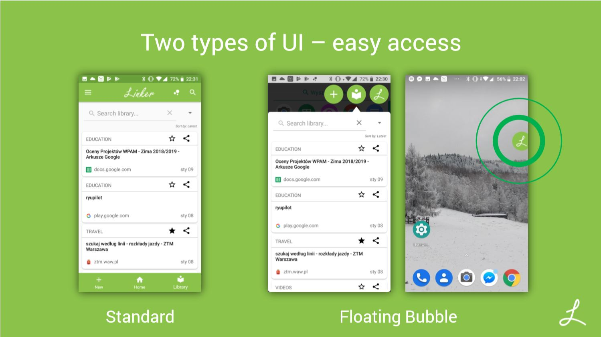

# Linker - Beta

Organize your places on the Internet with Linker - mobile app helping organize user URLs, automatically parsing them and learning how to categorize them. Provides convenient and well known Messenger-style bubble ui.

  

## Features:

- Two types of UI – **easy access**
- **Automatic parsing** and categorizing URLs from your Clipboard, Chrome browser or any Text Intent
- **Categorize** your links: use predefined ones or create your own!
- App **learns** how to categorize your links
- Easy **Tag system**: click on tag from TagCloud or any item to search library
- Log in with Google Account

## Author: Michał Smutkiewicz
## (C) Aesthetic Apps Studios 2018-19
